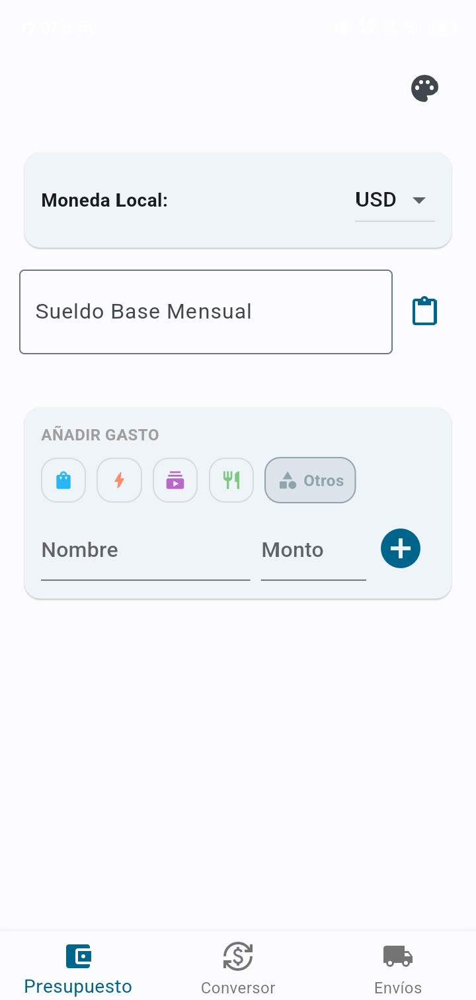
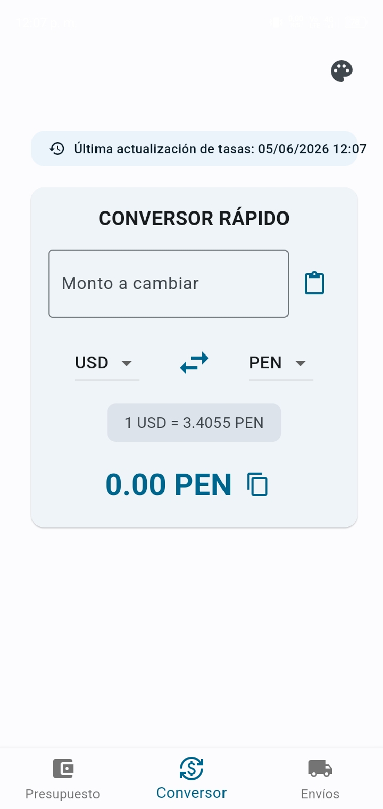
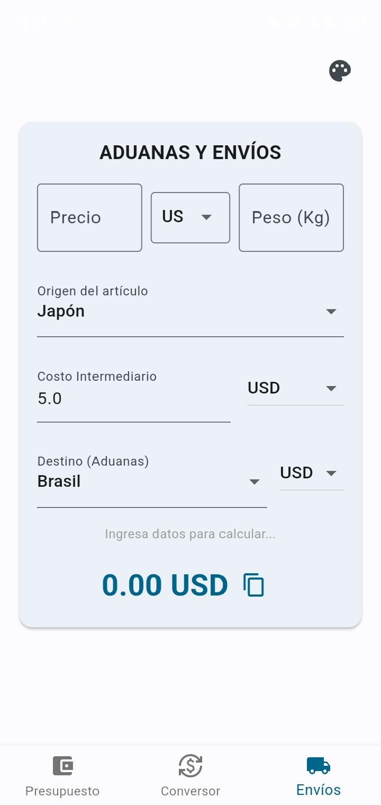

<h1 align="center">
  🚀 Syncra
</h1>

  <strong>Tu navaja suiza para finanzas personales, compras internacionales y cálculo de aduanas.</strong>

  

---

## 💡 ¿Qué es Syncra?
Syncra no es solo otro gestor de gastos. Es una herramienta diseñada específicamente para **compradores internacionales, coleccionistas y usuarios de servicios digitales** que necesitan tener el control total de su dinero en distintas divisas. 

¿Estás importando figuras de Japón a través de un proxy? ¿Quieres calcular cuánto te cobrará la aduana en Brasil o México? ¿Necesitas organizar tu presupuesto mensual para pases de batalla y suscripciones? Syncra lo calcula todo en segundos.

## ✨ Características Principales

### 📦 1. Calculadora de Aduanas y Envíos (Proxies)
Olvídate de las sorpresas desagradables al recibir un paquete.
* Calcula el costo total de importación (CIF).
* Incluye campos dedicados para **Costo de Intermediario (Proxy)**.
* Soporta reglas de impuestos locales de distintos países (ej. ICMS, límites de $50 o $200 libres de impuestos).
* *Ideal para importar desde Japón, China o EE.UU.*

### 💱 2. Conversor Rápido en Tiempo Real
* Tasas de cambio actualizadas automáticamente (con indicador de última actualización).
* Interfaz a un toque: escribe, convierte y copia el resultado al portapapeles.

### 💰 3. Presupuesto Dinámico
* Define tu Moneda Local y tu Sueldo Base.
* Añade gastos rápidamente por categorías (Compras, Servicios, Suscripciones, Comida, Otros).
* Mantén el control de tus compras de bienes físicos y digitales.

### 🎨 4. Personalización a tu Medida
Tu app, tus reglas. Syncra se adapta a tu estilo visual y preferencias de idioma:
* **Modo Oscuro Nativo:** Descansa tu vista con un diseño oscuro elegante y optimizado.
* **Temas de Color:** Elige entre 6 colores de acento diferentes para personalizar la interfaz a tu gusto.
* **Soporte Bilingüe:** Cambia instantáneamente entre Español e Inglés sin reiniciar la app.

---

## 📸 Vistazo Rápido

  
  &nbsp;&nbsp;&nbsp;
  
  &nbsp;&nbsp;&nbsp;
  
  &nbsp;&nbsp;&nbsp;
  

---

## 📥 Cómo instalar (Android)

Syncra es un proyecto 100% de código abierto, sin anuncios y enfocado en la privacidad. Como la app se distribuye de manera independiente, puedes instalarla de forma segura directamente desde este repositorio.

1. Ve a la sección [Releases](https://github.com/NoctisMr/syncra/releases/latest) y descarga el archivo `app-release.apk`.
2. Abre el archivo descargado en tu teléfono.
3. Si tu dispositivo muestra una advertencia de seguridad, selecciona **"Configuración"** y activa la opción **"Permitir la instalación desde esta fuente"**.
4. ¡Instala, abre Syncra y toma el control de tus finanzas!

---

## 🛠️ Tecnologías Utilizadas

* **Framework:** Flutter & Dart
* **Almacenamiento Local:** Hive (No-SQL, super rápido, todo se guarda en tu dispositivo).
* **APIs:** Integración con APIs de divisas abiertas y geolocalización para auto-detectar el país y configurar la moneda local al instante.
* **CI/CD:** GitHub Actions para la compilación automática del APK.

---

## 🤝 Contribuciones y Soporte
Si encuentras algún *bug* o tienes una idea para mejorar los cálculos de aduana de tu país, ¡eres libre de abrir un **Issue** o enviar un **Pull Request**!
